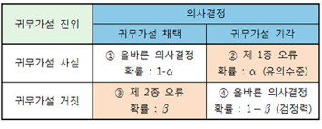

# 가설

## 추론
 - 표본에서 얻은 정보를 이용하여 모집단에 대해 알아보는것
   - 추정 : 모수를 점 또는 구간으로 추측
   - 검정 : 모집단에 대한 가설 입증

## 가설검정
 - 모집단의 어떤 현상에 대한 예상 또는 주장이 옳은지 틀렸는지를 표본자료를 이용하여 판단하는 것
   - 통계적 가설 : 모집단에 대한 예상 또는 주장

## 가설검정의 단계
 1. 모집단의 특성에 대한 주장, 즉 가설을 설정한다
 2. $$검정의 유의수준 \alpha를 정한다$$
 3. 표본을 추출하여 검정통계량을 계산한다
 4. 검정통계량에 대한 p값을 구하여 가설에 대한 결론을 내린다. 또는 기각역에 속하는지를 검토하여 가설에 대한 결론을 내린다.

## 가설
### 통계적 가설 : 모집단에 대한 예상 또는 주장
 - $$대립가설(H_1) : 연구자의 새로운 주장$$
 - $$귀무가설(H_0) : 과거이론 또는 경험적으로 믿어지는 이론$$
    - 연구자의 주장에 대한 배반적 가설
 - 귀무가설에 대하여 살펴본 뒤 이를 기각함으로 대립가설을 주장하고자 함

## 가설설정 규칙
 - 귀무가설은 모수를 특정한 값으로 표현한다
   - $$H_0 : \theta = \theta_0$$
 - 대립가설은 귀무가설에서 지적한 모수의 값이 아닌 어떤 영역으로 나타나는데, 양쪽을 다 고려하는 양측검정과 한쪽만 고려하는 단측검정이 있다
   - $$H_1 : \theta \neq  \theta_0$$
   - $$H_1 : \theta > \theta_0$$
   - $$H_1 : \theta < \theta_0$$
## 예
### 기존의 주장에 따라 평균키가 165cm인 집단이 있다고 가정
 - 165cm이다.
   - $$H_0 : \mu_0 = 165$$
 - 이때 새로운 가설은 3가지 정도가 나옴
   - 귀무가설 : 165cm이다. $$H_0 : \mu_0 = 165$$
   - 대립가설-단측검정
     - 165cm보다 작다 $$H_1 : \mu_1 < \mu_0$$
     - 165cm보다 크다 $$H_1 : \mu_1 > \mu_0$$
  - 대립가설-양측검정
    - 165cm이 아니다 $$H_1 : \mu_1 \neq \mu_0$$

## 검정통계량
 - 검정에 사용하기 위햐여 표본자료에서 구한 통계량
 - 일반적으로 검정하려는 모수의 점추정량이 되기도 하고, 이 점추정량을표준화한 것을 사용하기도 한다.
   - 검정하려는 모수
     - $$\sigma를 알 때, 정규분포 모집단 \mu는$$
     $$Z = \frac{\bar X - \mu_0}{\sigma / \sqrt n}  N(0, 1)$$
     - $$\sigma를 모를 때, 정규분포 모집단 \mu는$$ $$t = \frac{\bar X - \mu_0}{s / \sqrt n} t(n-1)$$
 - 1종 오류(알파오류) : 귀무가설이 실제 옳은데도 불구하고 검정 결과가 그 가설을 기각하는 오류
   - $$\alpha = Pr{H_0 기각 | H_0 사실}$$
 - 2종 오류(베타오류) : 귀무가설이 틀린데도 불구하고 검정 결과가 그 가설을 채택하는 오류
   - $$\beta = Pr{H_0 기각실패 | H_1 사실}$$

## 주요 개념1
 - 검정력 : 귀무가설이 틀렸을 때 이를 기각하여 대립가설을 채택
   - 검정력 = 1 - 2종 오류 확률
 - 유의수준
   - 1종 오류를 유의수준으로 함
   - 보통 0.05/0.01/0.001로 정함



## 주요 개념2
 - p값
   - 귀무가설이 사실일 때, 표본이 대립가설 방향으로 검정통계량의 값보다 더 극단적일 확률
   $$p \ge \alpha\  귀무가설 기각 못함$$
   $$p < \alpha\ 귀무가설 기각$$
 - 기각역
   - 귀무가설이 사실이 아니라고 기각하게 되는 검정통계량의 영역

## 예제
### 한국 청소년들의 하루 평균 TV시청시간이 3시간이라 주장
### 그 정도는 안될 것이라 주장
 - TV 시청 시간은 정규분포를 따르며 분산은 과거 조사에서 1로 알려져 있음
 - 어느 편이 맞는 지 알아보기 위하여 단순임의 추출한 100명을 조사한 결과 평균2.75시간
$$H_0 : 평균 3시간$$
$$H_1 : 3시간이 아니다$$
```R
sample_mean <- 2.75
population_mean <- 3
sample_size <- 100
sample_sd <- 1
t_stat <- (sample_mean - population_mean) / (sample_sd / sqrt(sample_size))
df <- sample_size - 1
p_value <- 2 * pt(-abs(t_stat), df)
cat("t-통계량:", t_stat, "\n")
cat("자유도:", df, "\n")
cat("p-value:", p_value, "\n")
alpha <- 0.05
if (p_value < alpha){
  cat("귀무가설 기각")
} else{
  cat("귀무가설 채택")
}
```